<a href="https://github.com/MattyIceMatrix">
  <picture>
    <source media="(prefers-color-scheme: dark)" srcset="dark_mode.svg">
    
  </picture>
</a>

## `$ ls ~/projects`

15 repositories: 4 public, 11 private. Private projects are listed by what they do; their code, methods and results are shared only on request, under NDA where needed.

### ⚡ Edge AI

| Project | What it does | Stack |
|---|---|---|
| **KRYPTON · Proving Ground**  | Safety and validation tooling for machine-learning models that run on industrial machine controllers. Research prototype on simulated data. | `Python` `ONNX` `Edge inference` |
| **Bounce AI**  | On-device basketball shooting coach (*Biomechanical Observation Unit for Neural Coaching at the Edge*). | `Python` `C` `TFLite` |

### 🔒 AI governance and formal verification

| Project | What it does | Stack |
|---|---|---|
| **[VLC-1](https://github.com/MattyIceMatrix/vlc-1)**   | Open specification and conformance checker for proving an AI audit log is complete, not just tamper-evident. | `Python` `Coq` |
| **OCTA Sentinel**  | Formally verified runtime enforcement for AI systems on Linux. | `Coq` `C` `Rust` |

### 🏭 Compliance software

| Project | What it does | Stack |
|---|---|---|
| **Moore Labs**  | Offline, bilingual (German/English) compliance and security tools for European companies: EU AI Act, Cyber Resilience Act, NIS2, DORA, GDPR and e-invoicing. | `Python` |

### 🌐 Live web apps

| App | What it is |
|---|---|
| **[MineDime Terminal](https://mattyicematrix.github.io/minedime/)** | Commodity intelligence terminal with a quant research lab. Simulated data. |
| **[Wochenkorb](https://mattyicematrix.github.io/wochenkorb/)** | Weekly ALDI SÜD and LIDL deals, a budgeted shopping list and recipes built from the deals. |

### 🗂 Earlier prototypes (2026)
Single-file web apps from the first phase of Moore Labs, all private: **OCTA Systems** (AI-governance dashboard), **SnapWave** (Wi-Fi planning and IoT fleet management), **Earth: Solved** (planetary scenario modelling), **ShellForge** (IT training) and **Precision Procurement Academy** (procurement training).
